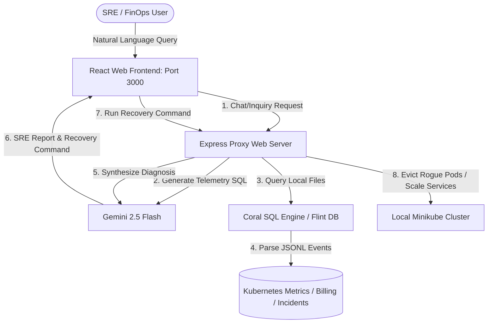

# 🚀 Flint AI: Autonomous SRE Investigator & Cloud Cost Guard

**Flint AI** (built on the ArcOps & Finguard ecosystem) is a real-time, zero-trust cloud billing anomaly detection system and self-healing Kubernetes SRE investigator. Using a local-first Coral SQL engine and Gemini LLM intelligence, Flint AI monitors cluster telemetry, identifies resource/cost leaks (like crypto-mining malware or worker queue bottlenecks), and allows SREs to apply single-click remediation directly from a chat panel.

---

## 🎨 Visual Architecture



---

## ✨ Core Features

*   **⚡ Local-First SQL Telemetry (Coral)**: High-speed querying of database, billing, deployments, worker events, and firewall traces using SQL direct-over-files without db server overhead.
*   **🤖 Gemini SRE Co-Pilot**: Translates SRE natural language questions (e.g., *"Why did our costs spike yesterday?"*) into precise SQL, queries local telemetry logs, and generates actionable, technical incident reports.
*   **🛠️ Self-Healing & One-Click Recovery**: Recommends and executes verified cluster repair commands (like `kubectl scale` or `kubectl delete`) directly from the dashboard to fix live issues.
*   **🔬 Real-Time Workload Simulator**: Integrated dropdown simulation triggers for edge scenarios including **Crypto Miner Intrusion**, **Queue Backlog**, **Bad Docker Images**, **Zombie Instances**, and **GPU Quota Exhaustion**.
*   **🔒 Zero-Trust Service Isolation**: Cloud credentials transit is entirely isolated. The public dashboard only passes metadata identifiers, and the secure processing server retrieves access credentials keylessly.

---

## 📂 Repository Structure

```
.
├── landing_page/    # Public Web Server & SRE Client Dashboard (React + Express)
├── backend/         # Private Processing Server (Python FastAPI + uv)
│   ├── coral/       # Coral SQL engine binaries, schema config, and JSONL data
│   └── k8s/         # Demo YAML manifests (stress-pod, backlog-pod, deployment)
└── myapp/           # Cross-platform Client Mobile Application (Expo / React Native)
```

---

## 🛠️ Step-by-Step Run Guide

### 1. 🌐 Web Dashboard & SRE Console (`landing_page`)
The React dashboard runs on port `3000`.

1.  Navigate to the directory:
    ```bash
    cd landing_page
    ```
2.  Install dependencies:
    ```bash
    npm install
    ```
3.  Set up environment variables (`.env.local`):
    ```ini
    GEMINI_API_KEY=your_gemini_api_key
    ```
4.  Start the development server:
    ```bash
    npm run dev
    ```

### 🐍 2. Processing Server Backend (`backend`)
The Python server handles credential management and background ingestion scheduling.

1.  Navigate to the directory:
    ```bash
    cd backend
    ```
2.  Sync python dependencies:
    ```bash
    uv sync
    ```
3.  Set up environment variables (`.env`):
    ```ini
    SUPABASE_URL=your_supabase_url
    SUPABASE_KEY=your_supabase_anon_key
    UPSTASH_REDIS_URL=your_redis_url
    UPSTASH_REDIS_TOKEN=your_redis_token
    ```
4.  Start the FastAPI server:
    ```bash
    uv run uvicorn src.main:app --reload --port 8000
    ```

---

## 🔬 Interactive Scenario Simulations

Flint AI includes preconfigured workloads to demonstrate active threat resolution. Run these side-by-side with your dashboard in a split terminal window!

### Scenario A: Queue Backlog & Memory Throttling
1.  In your terminal, deploy the heavy worker backlog:
    ```bash
    kubectl apply -f backend/k8s/backlog-pod.yaml -f backend/k8s/worker-deployment.yaml
    ```
2.  On the dashboard, you will see `core-ledger` pods crash and enter `CrashLoopBackOff` as memory allocations breach limits.
3.  Select the crashed pod, view the live logs showing `OutOfMemoryError`, and use SRE Co-Pilot to execute recovery actions (scaling/re-configuring resources).

### Scenario B: Unsanctioned Crypto Miner Intrusion
1.  In your terminal, deploy the malicious compute stressor:
    ```bash
    kubectl apply -f backend/k8s/stress-pod.yaml
    ```
2.  The dashboard will flag a critical warning: a rogue pod named `security-anomaly-pod` is consuming **99% CPU utilization**.
3.  SRE Co-pilot identifies the threat. Click **"Delete Miner Pod"** on the dashboard. The cluster automatically terminates the pod, returning metrics to green.
